# Результаты работы с темой инструменты Git

1. Найдите полный хеш и комментарий коммита, хеш которого начинается на aefea.

    Найти полный хэш данного коммита можно при помощи команды: git log -1 --pretty=format:"%H %s" aefea (так же более проще это выполняется командой git show aefea, но данная команда имеет более обширный вывод)
     
    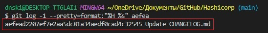
     

2. Какому тегу соответствует коммит 85024d3?
    Найти тег соответвующий коммиту 85024d3 можно при помощи команды git show 85024d3:
     
    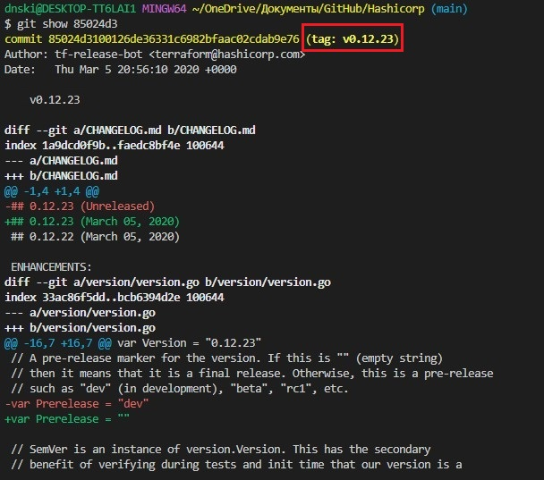
     
    Или при помощи команды git tag --points-at 85024d3:
     
    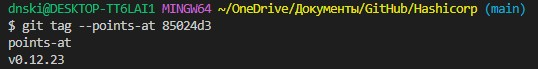
     
3. Сколько родителей у коммита b8d720? Напишите их хеши.
    При помощи команды git log -5 b8d720 --graph можно увидеть дерево коммитов начиная с коммита b8d720 ограничиваясь пятью коммитами. Из вывода данной команды видно, что коммит  b8d720 являетя мерж-коммитом, откуда можно сделать вывод о том, что он имеет 2 родителя и их хеши можно увидеть в этом же выводе.
     
    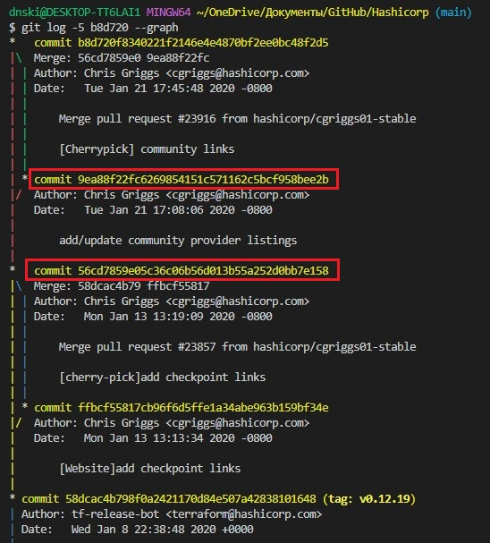
     
    Или же можно воспользоваться ссылкой на предков: git show b8d720^ покажет первого родителя, а git show b8d720^2 покажет второго родителя:
     
    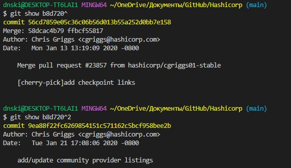
     
    Хеш первого и второго родителей соответственно: 56cd7859e05c36c06b56d013b55a252d0bb7e158, 9ea88f22fc6269854151c571162c5bcf958bee2b
     
4. Перечислите хеши и комментарии всех коммитов которые были сделаны между тегами v0.12.23 и v0.12.24.
    Все хеши коммитов и комментарии к ним можно найти при помощи команды git log v0.12.23...v0.12.24 или git log v0.12.23..v0.12.24:
     
    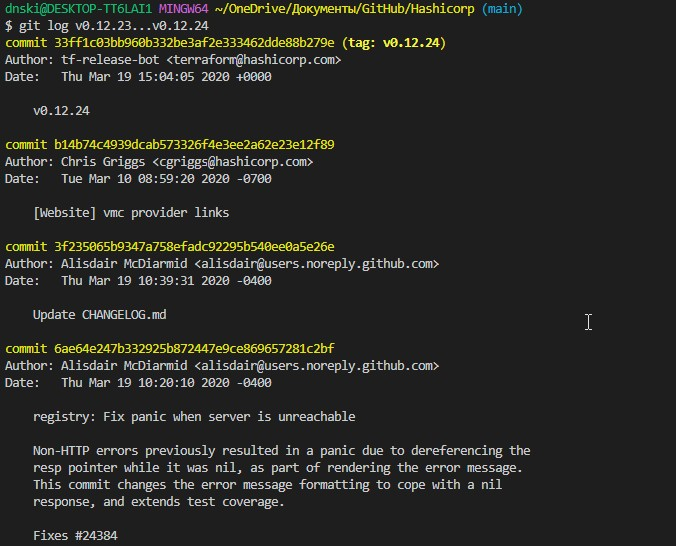
     
    Или же это можно сделать при помощи команды git log v0.12.23 --oneline:
     
    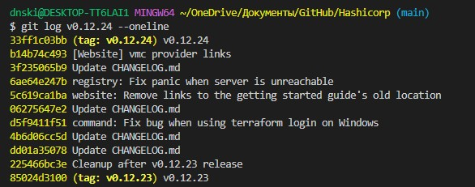
     
    хэши и комментарии: b14b74c493 [Website] vmc provider links;
                        3f235065b9 Update CHANGELOG.md;
                        6ae64e247b registry: Fix panic when server is unreachable;
                        5c619ca1ba website: Remove links to the getting started guide's old location;
                        06275647e2 Update CHANGELOG.md;
                        d5f9411f51 command: Fix bug when using terraform login on Windows;
                        4b6d06cc5d Update CHANGELOG.md;
                        dd01a35078 Update CHANGELOG.md;
                        225466bc3e Cleanup after v0.12.23 release;
     
5. Найдите коммит в котором была создана функция func providerSource, ее определение в коде выглядит так func providerSource(...) (вместо троеточия перечислены аргументы).
    Данный коммит можно найти при помощи команды git log с ключом -S, на данном рисунке видны 2 коммита, во втором была создана эта функция, а в первом изменена:
     
    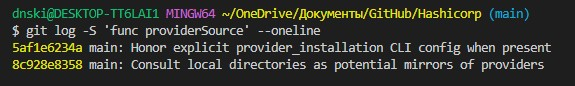
     
    Если выполнить git show 8c928e8358, то можно увидеть создание данной функции:
     
    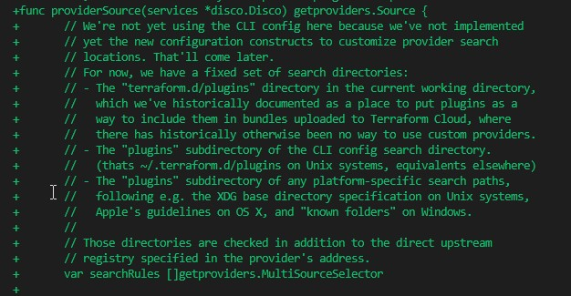
     
    Так же это можно сделать в несколько шагов. При помощи команды git grep --break --heading -n -e 'func providerSource' которая ищет совпадение по ключу -e, ключ -n выводит номер строки в файле, heading выводит название файла, а --break новую строку после каждого совпадения:
     
    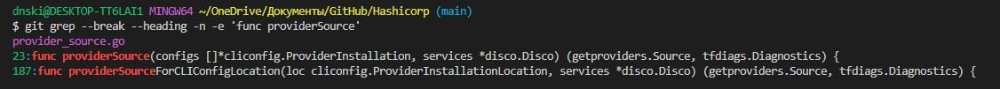
     
    Далее найдя имя файла, можно найти изменения в теле функции при помощи команды git с ключом -L:
     
    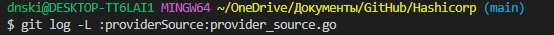
     
    И в выводе данной команды найти коммит, в котором была создана данная функция:
     
    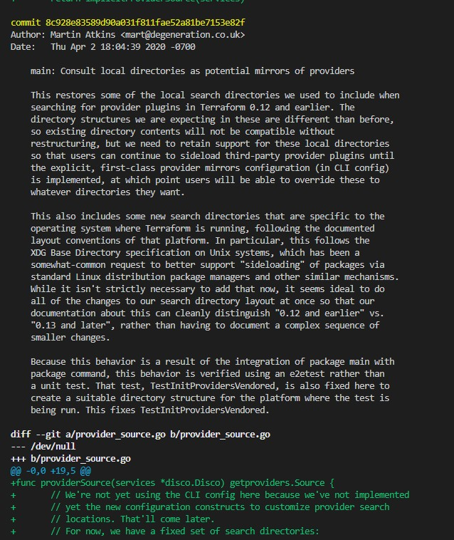
     
6. Найдите все коммиты в которых была изменена функция globalPluginDirs.
    Это можно сделать методом который описывался выше. Сначала нужно найти название файла:
     
    .jpg)
     
    И далее при помощи команды git log с ключом -L найти все коммиты:
    
     
7. Кто автор функции synchronizedWriters?
    Чтобы найти автора данной функции можно воспользоваться командой git log с ключом -S:
     
    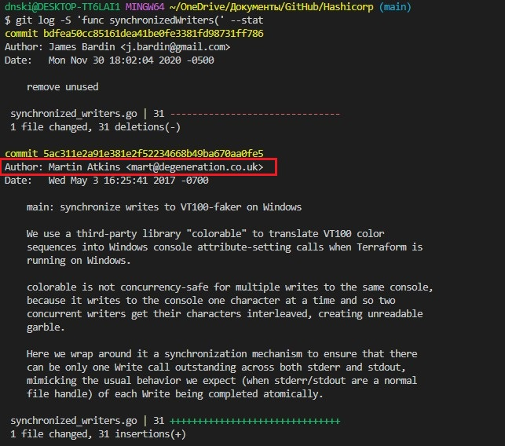
     

