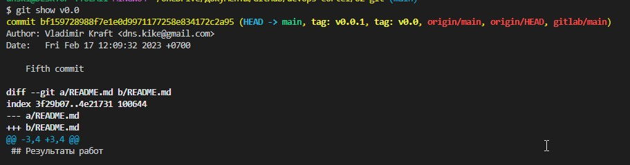
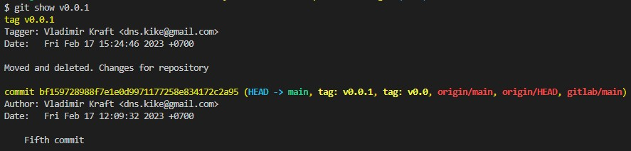
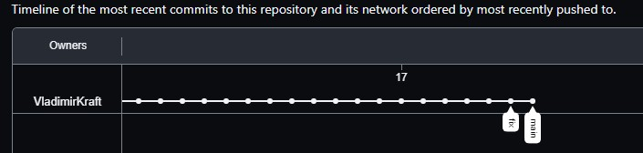
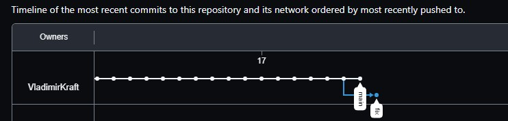
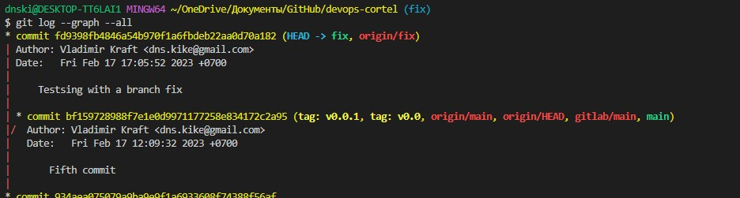

# Результаты работы с темой Основы Git

- Легковесные теги - несут в себе название тега и название коммита с которым связаны
     
    
     
- Аннотированные теги - полноценный объект, содержит в себе информацию об авторе, дату создания и связь с коммитом
     
    
     

- Ветки:
     
     На данном рисунке видно, что новая ветка fix была создана на предпоследнем коммите, но в ней не произошло никаких изменений.
      
    
     
    На данном рисунке отслеживается изменение в ветке fix.
     
    
     

    