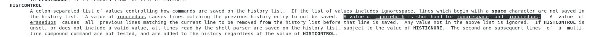
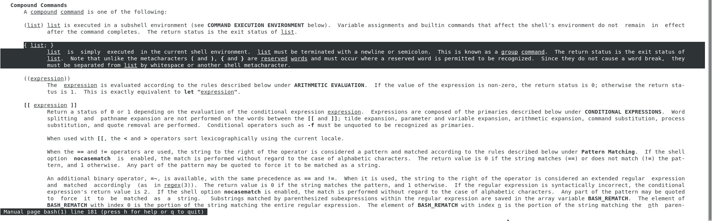
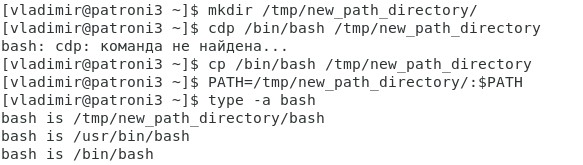
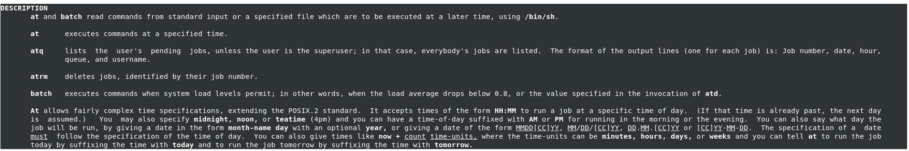

# Работа в терминале

1. Как добавить оперативной памяти или ресурсов процессора виртуальной машине?
     
    
     
2. Ознакомьтесь с разделами man bash, почитайте о настройках самого bash: какой переменной можно задать длину журнала history, и на какой строчке manual это описывается? что делает директива ignoreboth в bash?
     
    Длину журнала history можно задать с помощью переменной HistSize описанной на 518 строчке manual. Если значение не установлено, то история команд не сохраняется. Описание самого журнала History описывается на 1990 строчке manual.
     
    
     
    Значение ignoreboth является сокращением для ignorespace и ignoredups. Если в списке значений есть ignorespace, строки, начинающиеся с пробела, не сохраняются в список истории. Значение ignoredups приводит к тому, что строки, соответствующие предыдущей записи истории, не сохраняются.
     
    
     
3. В каких сценариях использования применимы скобки {} и на какой строчке man bash это описано?
     
    181 строка manual. {} используются для создания составных команд, команды находящиеся в {} будут выполнены в контексте текущего процесса, и результаты их вызова будут сохранены в текущем контексте.
     
    
     
4. С учётом ответа на предыдущий вопрос, как создать однократным вызовом touch 100000 файлов? Получится ли аналогичным образом создать 300000? Если нет, то почему?
     
    Создать 100000 файлов можно при помощи конструкции touch {1..100000}. 300000 файлов создать не получится, так как будет слишком большая длина списка. Нужно увеличить переменную ARG_MAX (объем передаваемых аргументов команде).
     
5. В man bash поищите по /\[\[. Что делает конструкция [[ -d /tmp ]]
     
    Данная конструкция вернет 0 если дерриктория tmp существует
     
6. Сделайте так, чтобы в выводе команды type -a bash первым стояла запись с нестандартным путем, например bash is ... Используйте знания о просмотре существующих и создании новых переменных окружения, обратите внимание на переменную окружения PATH
     
    
     
7. Чем отличается планирование команд с помощью batch и at?
     
    batch однократно исполняет команды, когда нагрузка системы падает ниже 0.8(по умолчанию), в то время как at выполняет команды в установленное время.
     
    
     

