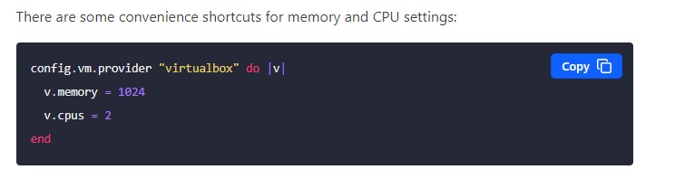

# Работа в терминале

1. Как добавить оперативной памяти или ресурсов процессора виртуальной машине?
     
    
     
2. Ознакомьтесь с разделами man bash, почитайте о настройках самого bash: какой переменной можно задать длину журнала history, и на какой строчке manual это описывается? что делает директива ignoreboth в bash?
     
    