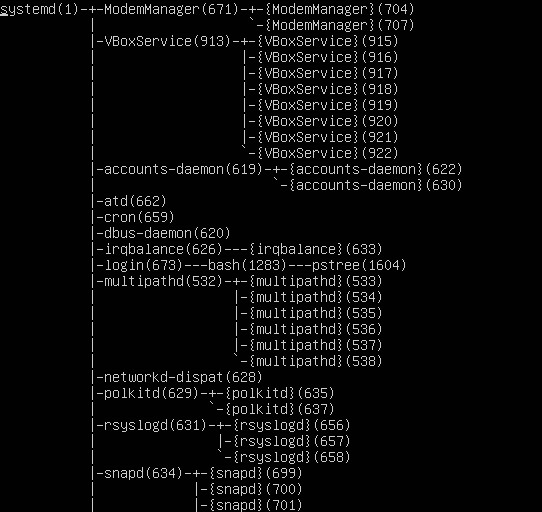
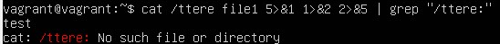
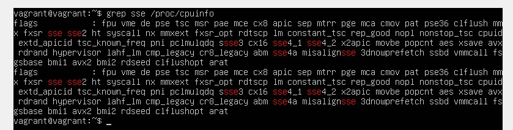
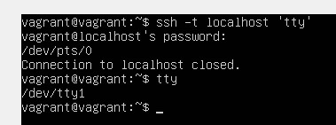

# Работа в терминале - 2 

1. Какого типа команда `cd`? Попробуйте объяснить, почему она именно такого типа: опишите ход своих мыслей, если считаете, что она могла бы быть другого типа.
    <br/>
    Для того, чтобы узнать какого типа команда `cd` можно выполнить команду: `type cd`
    <br/>
    
    <br/>
    `cd` это команда `shell builtin`. Т.е. команда встроенная в оболочку и реализована как часть исходного кода оболочки. Оболочка распознает, что команда, которую ей было предложено выполнить, была одной из ее встроенных функций, и выполняет это действие самостоятельно, не обращаясь к отдельному исполнительному файлу.
    <br/>
2. Какая альтернатива без pipe команде `grep <some_string> <some_file> | wc -l`? Ознакомьтесь с [документом](http://www.smallo.ruhr.de/award.html) о других подобных некорректных вариантах использования pipe.
    <br/>
    Альтернативой данной команде будет команда:
    <br/>
    ```bash
    grep -c
    ```
    <br/>
3. Какой процесс с `PID 1` является родителем для всех процессов в вашей виртуальной машине Ubuntu 20.04?
    <br/>
    Это процесс systemd
    <br/>
    
    <br/>
4. Как будет выглядеть команда, которая перенаправит вывод stderr `ls` на другую сессию терминала?
    <br/>
    ```bash
    ls 2 > /dev/pts/<номер терминала>
    ```
    <br/>
5. Получится ли одновременно передать команде файл на `stdin` и вывести ее `stdout` в другой файл? Приведите работающий пример.
    <br/>
    ```bash
    cat < primer.txt > primer2.txt
    ```
    <br/>
6. Получится ли, находясь в графическом режиме, вывести данные из `PTY` в какой-либо из эмуляторов `TTY`? Сможете ли вы наблюдать выводимые данные?
    <br/>
    ```bash
    echo hello world > /dev/tty3
    ```
    <br/>
    Для того, чтобы наблюдать выводимые данные нужно переключиться на соответствующий терминал ctl + alt + F3
    <br/>
7. Выполните команду `bash 5>&1`. К чему она приведет? Что будет, если вы выполните `echo netology > /proc/$$/fd/5`? Почему так происходит?
    <br/>
    `bash 5>&1` данная команда создает новый дескриптор 5 и перенаправляет его вывод в stdout(дескриптор 1).
    <br/>
    `echo netology > /proc/$$/fd/5` данная команда перенаправляет вывод команды `echo` в дескриптор 5, но  вывод дескриптора 5 перенаправлен в stdout (дескриптор 1), поэтому сообщение `netology` будет видно в терминале.
    <br/>
8. Получится ли в качестве входного потока для pipe использовать только stderr команды, не потеряв при этом отображение stdout на pty? Напоминаем: по умолчанию через pipe передается только stdout команды слева от | на stdin команды справа. Это можно сделать, поменяв стандартные потоки местами через промежуточный новый дескриптор, который вы научились создавать в предыдущем вопросе.
    <br/>
    Для того, чтобы это получилось нужно поменять stout и stderr местами:
    <br/>
    
    <br/>
9. Что выведет команда `cat /proc/$$/environ`? Как еще можно получить аналогичный по содержанию вывод?
    <br/>
    Выводится список переменных окружения для процесса, под которым выполняется текущая оболочка bash. 
    Команда с аналогичным выводом `printenv`.
    <br/>
10. Используя `man`, опишите что доступно по адресам `/proc/<PID>/cmdline`, `/proc/<PID>/exe`.
    <br/>
    `/proc/<PID>/cmdline` это read-only файл, который содержит целую командную строку, использованную для вызова процесса, если процесс не является зомби. В последнем случае в этом файле ничего нет. Аргументы командной строки появляются здесь как набор строк, разделенных нулевыми байтами ('\0'), с дополнительным нулевым байтом после последней строки.
    <br/>
     `/proc/<PID>/exe` это символическая ссылка на соответствующий запущенному процессу выполняемый файл.
     <br/>
11. Узнайте, какую наиболее старшую версию набора инструкций SSE поддерживает ваш процессор с помощью `/proc/cpuinfo`.
    <br/>
    sse 4_2
    <br/>
    
    <br/>
12. При открытии нового окна терминала и `vagrant ssh` создается новая сессия и выделяется pty. Это можно подтвердить командой `tty`, которая упоминалась в лекции 3.2. 
    <br/>
    В случае выполнения одиночной команды ssh на удаленном сервере не выделяется TTY. Исправить это можно при помощи ключа -t, который позволяет принудительно выделить псевдотерминал: `ssh -t localhost 'tty'`
    <br/>
    
    <br/>
13. Бывает, что есть необходимость переместить запущенный процесс из одной сессии в другую. Попробуйте сделать это, воспользовавшись `reptyr`. Например, так можно перенести в `screen` процесс, который вы запустили по ошибке в обычной SSH-сессии.
    <br/>
    Утилита reptyr зависит от системного вызова ptrace для подключения к удаленной программе. В Ubuntu эта возможность по умолчанию отключена из соображений безопасности. Поэтому можно времено отключить его, выполнив:
    <br/>
    ```bash
    echo 0 > /proc/sys/kernel/yama/ptrace_scope
    ```
    <br/>
    После этого получилось применить команду reptyr.
    <br/>
14. `sudo echo string > /root/new_file` не даст выполнить перенаправление под обычным пользователем, так как перенаправлением занимается процесс shell'а, который запущен без `sudo` под вашим пользователем. Для решения данной проблемы можно использовать конструкцию `echo string | sudo tee /root/new_file`. Узнайте? что делает команда `tee` и почему в отличие от `sudo echo` команда с `sudo tee` будет работать.
    <br/>
    Команда `tee` считывает стандартный ввод(stdin), после чего записывает его в стандартный вывод (stdout) и одновременно копирует его в подготовленный файл или переменную.
    <br/>
    Команда с `sudo tee` будет работать т.к. `tee` запустится отдельным процессом из под `sudo`, и получая в stdin через pipe данные от `echo` у нее есть права записать в файл.
