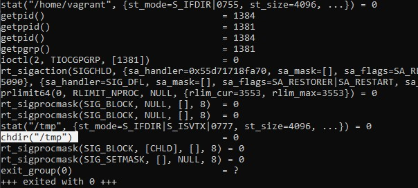
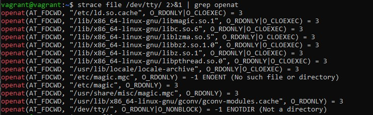
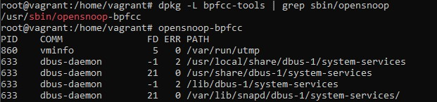
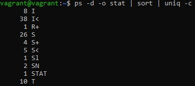
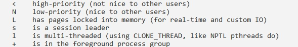

# Операционние системы - 1

1. Какой системный вызов делает команда `cd`?
    <br/>
    В прошлом ДЗ мы выяснили, что `cd` не является самостоятельной программой, это `shell builtin`, поэтому запустить `strace` непосредственно на `cd` не получится. Тем не менее, вы можете запустить strace на `/bin/bash -c 'cd /tmp'`. В этом случае вы увидите полный список системных вызовов, которые делает сам bash при старте.
    <br/>
    
    <br/>
    `cd` делает системный вызов `chdir()`
    <br/>
2. Попробуйте использовать команду `file` на объекты разных типов в файловой системе. Используя `strace` выясните, где находится база данных `file`, на основании которой она делает свои догадки.
    <br/>
    
    <br/>
    Информация, идентифицирующая эти файлы, считывается из скомпилированного файла - /usr/share/file/magic.mgc
    <br/>
    Так же эту информацию можно найти в `man file` на строке 33.
    <br/>
3. Предположим, приложение пишет лог в текстовый файл. Этот файл оказался удален (`deleted в lsof`), однако возможности сигналом сказать приложению переоткрыть файлы или просто перезапустить приложение – нет. Так как приложение продолжает писать в удаленный файл, место на диске постепенно заканчивается. Основываясь на знаниях о перенаправлении потоков предложите способ обнуления открытого удаленного файла (чтобы освободить место на файловой системе).
    <br/>
    Вручную можно "освободить" эти файлы так:
    <br/>
    ```bash
    > /proc/$PROC/fd/$FD
    ```
    <br/>
    Где $PROC - номер процесса, а $FD - номер файлового дескриптора.
    <br/>
4. Занимают ли зомби-процессы какие-то ресурсы в ОС (CPU, RAM, IO)?
    <br/>
    Зомби процесс это дочерний процесс в Unix-системе, завершивший своё выполнение, но ещё присутствующий в списке процессов операционной системы, чтобы дать родительскому процессу считать код завершения. `Процесс при завершении освобождает все свои ресурсы` (за исключением PID — идентификатора процесса) и становится «зомби» — пустой записью в таблице процессов, хранящей код завершения для родительского процесса.
    <br/>
5. На какие файлы вы увидели вызовы группы open за первую секунду работы утилиты?
    <br/>
    
    <br/>
6. Какой системный вызов использует `uname -a`? Приведите цитату из man по этому системному вызову, где описывается альтернативное местоположение в `/proc`, где можно узнать версию ядра и релиз ОС.
    <br/>
    Команда `uname -a` использует системный вызов `uname()`
    <br/>
    Цитата из man: Part of the utsname information is also accessible via /proc/sys/kernel/{ostype, hostname, osrelease, version, domainname}.
    <br/>
7. Чем отличается последовательность команд через `;` и через `&&` в bash? Есть ли смысл использовать в bash `&&`, если применить `set -e`?
    <br/>
    Команды разделенные `;` выполняются последовательно. Оболочка ждет завершения каждой команды по очереди. Статус возврата - это статус выхода последней выполненной команды.
    <br/>
    При разделенные `&&`, например: `command1 && command2`. command2 выполняется тогда и только тогда, когда command1 возвращает нулевой статус выхода(усрешно выполнено).
    <br/>
    Смысла использовать `&&` совместно с `set -e` нет, т.к. `set -e` выйдет из последовательности команд немедленно , если команда завершается с ненулевым статусом.
    <br/>
8. Из каких опций состоит режим bash `set -euxo pipefail` и почему его хорошо было бы использовать в сценариях?
    <br/>
    `-e` - Выйти немедленно, если команда завершается с ненулевым статусом;
    `-u` - Считать неустановленные переменные ошибкой при подстановке;
    `-x` - Печатать команды и их аргументы по мере их выполнения;
    `-o pipefail` - возвращаемое значение конвейера это статус последней команды для выхода с ненулевым статусом или ноль, если ни одна команда не вышла с ненулевым статусом;
    <br/>
    Данный режим обеспечивает прекращение работы сценария в случае ошибки и детализацию логирования.
    <br/>
9. Используя -o stat для ps, определите, какой наиболее часто встречающийся статус у процессов в системе. В man ps ознакомьтесь (/PROCESS STATE CODES) что значат дополнительные к основной заглавной буквы статуса процессов. Его можно не учитывать при расчете (считать S, Ss или Ssl равнозначными).
    <br/>
    
    <br/>
    
    <br/>
