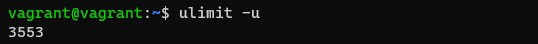

# Операционные системы - 2
1. На лекции мы познакомились с [node_exporter](https://github.com/prometheus/node_exporter/releases). В демонстрации его исполняемый файл запускался в background. Этого достаточно для демо, но не для настоящей production-системы, где процессы должны находиться под внешним управлением. Используя знания из лекции по systemd, создайте самостоятельно простой [unit-файл](https://www.freedesktop.org/software/systemd/man/systemd.service.html) для node_exporter:
    <br/>
    поместите его в автозагрузку,
    предусмотрите возможность добавления опций к запускаемому процессу через внешний файл (посмотрите, например, на `systemctl cat cron`),
    удостоверьтесь, что с помощью systemctl процесс корректно стартует, завершается, а после перезагрузки автоматически поднимается.
    <br/>
    Запуск node_exporter
    <br/>
    
    <br/>
    Помещение его в автозагрузку
    <br/>
    
    <br/>
    Создан unit-файл для Node_Exporter предусматривающий добавление опций к запускаемому процессу через внешний файл
    <br/>
    
    <br/>
    При помощи `systemctl` процесс корректно запускается, останавливается, после перезагрузки автоматически поднимается.
    <br/>
    
    <br/>
    
    <br/>
    
    <br/>
    
    <br/>
2. Ознакомьтесь с опциями node_exporter и выводом `/metrics` по-умолчанию. Приведите несколько опций, которые вы бы выбрали для базового мониторинга хоста по CPU, памяти, диску и сети.
    <br/>
    ```bash
    --collector.cpu
    --collector.cpufreq
    --collector.diskstats
    --collector.meminfo
    --collector.netstat
    ```
    <br/>
3. Установите в свою виртуальную машину [Netdata](https://github.com/netdata/netdata). Воспользуйтесь [готовыми пакетами](https://packagecloud.io/netdata/netdata/install) для установки (`sudo apt install -y netdata`).
    <br/>
    После успешной установки:
    в конфигурационном файле `/etc/netdata/netdata.conf` в секции [web] замените значение с localhost на `bind to = 0.0.0.0`,
    добавьте в Vagrantfile проброс порта Netdata на свой локальный компьютер и сделайте `vagrant reload`:
    `config.vm.network "forwarded_port", guest: 19999, host: 19999`
    <br/>
    После успешной перезагрузки в браузере на своем ПК (не в виртуальной машине) вы должны суметь зайти на `localhost:19999`. Ознакомьтесь с метриками, которые по умолчанию собираются Netdata и с комментариями, которые даны к этим метрика.
    <br/>
    
    <br/>
    
    <br/>
4. Можно ли по выводу `dmesg` понять, осознает ли ОС, что загружена не на настоящем оборудовании, а на системе виртуализации?
    <br/>
    Да, можно за это отвечают строчки вывода dmesg показанные на скринах ниже
    <br/>
    
    <br/>
    
    <br/>
5. Как настроен `sysctl fs.nr_open` на системе по-умолчанию? Определите, что означает этот параметр. Какой другой существующий лимит не позволит достичь такого числа (`ulimit --help`)?
    <br/>
    
    <br/>
    `fs.nr_open` обозначает максимальное количество файловых дескрипторов, которые может использовать процесс. Значение по умолчанию — 1024*1024 (1048576), которое должно быть достаточно для большинства машин.
    <br/>
    `ulimit -Hn` получает значение жёсткого ограничения на число одновременно открытых файлов, данное ограничение не позволит достичь числа `fs.nr_open`
    <br/>
6. Запустите любой долгоживущий процесс (не `ls`, который отработает мгновенно, а, например, `sleep 1h`) в отдельном неймспейсе процессов; покажите, что ваш процесс работает под PID 1 через `nsenter`. Для простоты работайте в данном задании под root (`sudo -i`). Под обычным пользователем требуются дополнительные опции (`--map-root-user`) и т.д.
    <br/>
    Запуск процесса `sleep 1h`  в отдельном неймспейсе
    <br/>
    
    <br/>
    Заходим в неймспейс с хоста
    <br/>
    
    <br/>
    
    <br/>
7. Найдите информацию о том, что такое `:(){ :|:& };:`. Запустите эту команду в своей виртуальной машине Vagrant с Ubuntu 20.04 (это важно, поведение в других ОС не проверялось). Некоторое время все будет "плохо", после чего (минуты) – ОС должна стабилизироваться. Вызов `dmesg` расскажет, какой механизм помог автоматической стабилизации.
Как настроен этот механизм по-умолчанию, и как изменить число процессов, которое можно создать в сессии?
    <br/>
    `:(){ :|:& };:` - это функция командной оболочки, которая создает свои собственные копии. Процесс постоянно воспроизводит себя, и его копии постоянно размножаются, быстро занимая все свое процессорное время и всю память. Это может привести к остановке компьютера. Это, в большей степени, атака вида denial-of-service (отказ в обслуживании).
    <br/>
    На данном скриншоте видно что функцию остановил pid controller.
    <br/>
    
    <br/>
    Чтобы ограничить число процессов необходимо применить команду `ulimit -u <число>`.
    <br/>
    
    <br/>