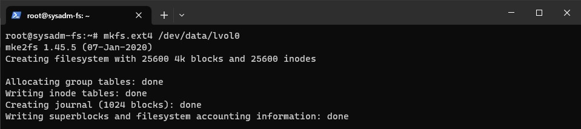

# Файловые системы 

1. Узнайте о [sparse](https://ru.wikipedia.org/wiki/%D0%A0%D0%B0%D0%B7%D1%80%D0%B5%D0%B6%D1%91%D0%BD%D0%BD%D1%8B%D0%B9_%D1%84%D0%B0%D0%B9%D0%BB) (разряженных) файлах.
    <br/>
    `Разрежённый файл` (англ. sparse file) — файл, в котором последовательности нулевых байтов заменены на информацию об этих последовательностях (список дыр).
    <br/>
    `Дыра` (англ. hole) — последовательность нулевых байт внутри файла, не записанная на диск. Информация о дырах (смещение от начала файла в байтах и количество байт) хранится в метаданных ФС.
    <br/>
    Преимущества:
    * экономия дискового пространства. Использование разрежённых файлов считается одним из способов сжатия данных на уровне файловой системы;
    * отсутствие временных затрат на запись нулевых байт;
    * увеличение срока службы запоминающих устройств.
    
    Недостатки:
    * накладные расходы на работу со списком дыр;
    * фрагментация файла при частой записи данных в дыры;
    * невозможность записи данных в дыры при отсутствии свободного места на диске;
    * невозможность использования других индикаторов дыр, кроме нулевых байт.
2. Могут ли файлы, являющиеся жесткой ссылкой на один объект, иметь разные права доступа и владельца? Почему?
    <br/>
    В Linux каждый файл имеет уникальный идентификатор - индексный дескриптор (inode). Это число, которое однозначно идентифицирует файл в файловой системе. Жесткая ссылка и файл, для которой она создавалась имеют одинаковые inode. Поэтому жесткая ссылка имеет те же права доступа, владельца и время последней модификации, что и целевой файл. Различаются только имена файлов. Фактически жесткая ссылка это еще одно имя для файла.
    <br/>
3. Сделайте `vagrant destroy` на имеющийся инстанс Ubuntu. Замените содержимое Vagrantfile следующим:
    ```bash
    path_to_disk_folder = './disks'

    host_params = {
        'disk_size' => 2560,
        'disks'=>[1, 2],
        'cpus'=>2,
        'memory'=>2048,
        'hostname'=>'sysadm-fs',
        'vm_name'=>'sysadm-fs'
    }
    Vagrant.configure("2") do |config|
        config.vm.box = "bento/ubuntu-20.04"
        config.vm.hostname=host_params['hostname']
        config.vm.provider :virtualbox do |v|

            v.name=host_params['vm_name']
            v.cpus=host_params['cpus']
            v.memory=host_params['memory']

            host_params['disks'].each do |disk|
                file_to_disk=path_to_disk_folder+'/disk'+disk.to_s+'.vdi'
                unless File.exist?(file_to_disk)
                    v.customize ['createmedium', '--filename', file_to_disk, '--size', host_params['disk_size']]
                end
                v.customize ['storageattach', :id, '--storagectl', 'SATA Controller', '--port', disk.to_s, '--device', 0, '--type', 'hdd', '--medium', file_to_disk]
            end
        end
        config.vm.network "private_network", type: "dhcp"
    end
    ```
    Эта конфигурация создаст новую виртуальную машину с двумя дополнительными неразмеченными дисками по 2,5 Гб.

    <br/>
4. Используя `fdisk`, разбейте первый диск на два раздела: 2 Гб и оставшееся пространство.
    <br/>
    
    <br/>
5. Используя `sfdisk`, перенесите эту таблицу разделов на второй диск.
    <br/>
    
    <br/>
6. Соберите `mdadm` RAID1 на паре разделов 2 Гб.
    <br/>
    
    <br/>
7. Соберите `mdadm` RAID0 на второй паре маленьких разделов.
    <br/>
    
    <br/>
8. Создайте два независимых PV на получившихся md-устройствах.
    <br/>
    
    <br/>
9. Создайте общую volume-group на этих двух PV.
    <br/>
    
    <br/>
10. Создайте LV размером 100 Мб, указав его расположение на PV с RAID0.
    <br/>
    
    <br/>
11. Создайте `mkfs.ext4` ФС на получившемся LV.
    <br/>
    
    <br/>
12. Смонтируйте этот раздел в любую директорию, например, `/tmp/new`.
    <br/>
    
    <br/>
13. Поместите туда тестовый файл, например, wget `https://mirror.yandex.ru/ubuntu/ls-lR.gz -O /tmp/new/test.gz`.
    <br/>
    
    <br/>
14. Прикрепите вывод `lsblk`.
    <br/>
    
    <br/>
15. Протестируйте целостность файла:
    <br/>
    
    <br/>
16. Используя pvmove, переместите содержимое PV с RAID0 на RAID1.
    <br/>
    
    <br/>
17. Сделайте `--fail` на устройство в вашем RAID1 md.
    <br/>
    
    <br/>
18. Подтвердите выводом `dmesg`, что RAID1 работает в деградированном состоянии.
    <br/>
    
    <br/>
19. Протестируйте целостность файла — он должен быть доступен несмотря на «сбойный» диск:
    <br/>
    
    <br/>
20. Погасите тестовый хост — `vagrant destroy`.
    <br/>
    
    <br/>
