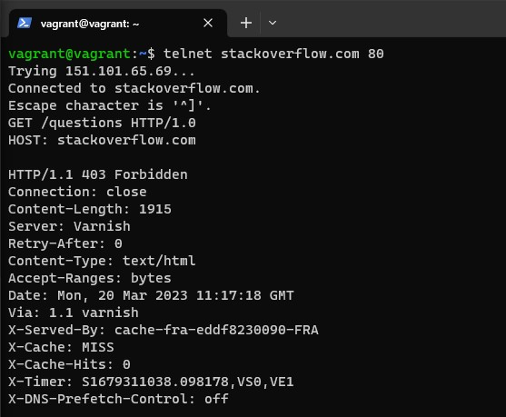
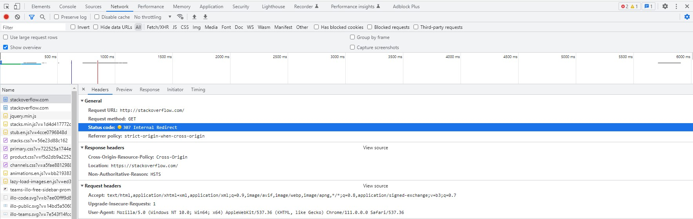
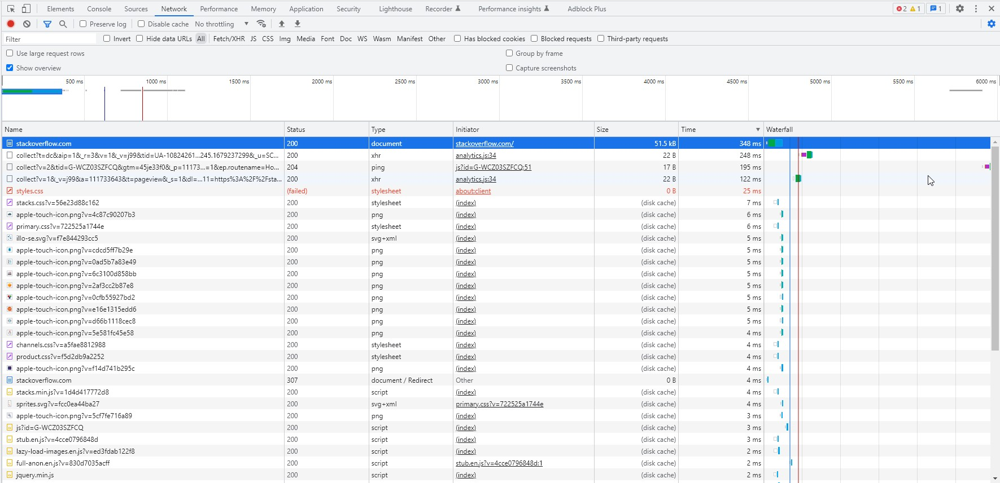
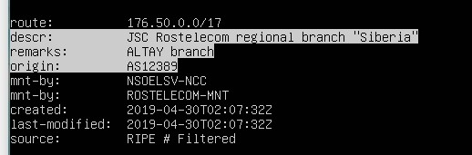
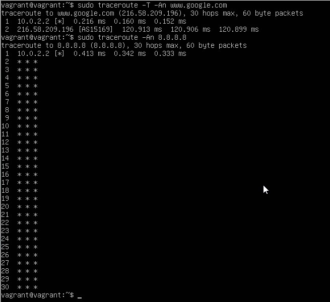
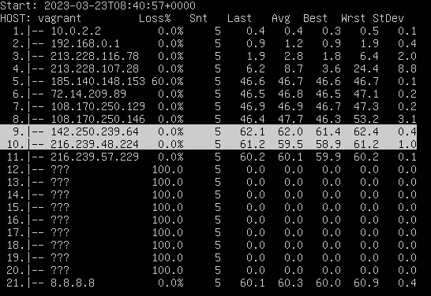
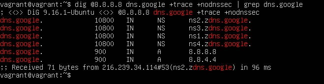
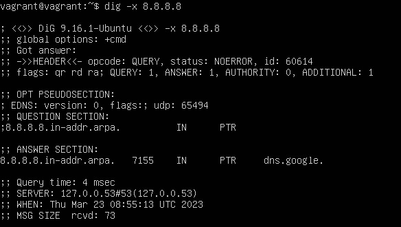
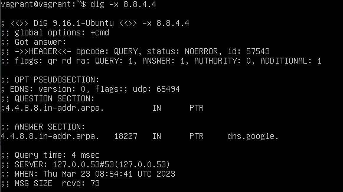

# Компьютерные сети - 1

1. Работа c HTTP через telnet.

    * Подключитесь утилитой telnet к сайту stackoverflow.com:
    `telnet stackoverflow.com 80`
    * Отправьте HTTP-запрос:
    ```bash
    GET /questions HTTP/1.0
    HOST: stackoverflow.com
    [press enter]
    [press enter]
    ```

    Полученный HTTP-код:

    

    Сервер понял запрос, но отказывается его выполнять. Авторизация не поможет и запрос повторять не следует.Этот код состояния обычно используется, когда сервер не хочет раскрывать, почему именно запрос был отклонен, или когда нет другого ответа.

2. Повторите задание 1 в браузере, используя консоль разработчика F12:

    * откройте вкладку Network;
    * отправьте запрос [http://stackoverflow.com](http://stackoverflow.com);
    * найдите первый ответ HTTP-сервера, откройте вкладку Headers;
    * укажите в ответе полученный HTTP-код;
    * проверьте время загрузки страницы и определите, какой запрос обрабатывался дольше всего;
    * приложите скриншот консоли браузера в ответ.

    Полученный HTTP-код:

    

    Код ответа состояния перенаправления HTTP 307 Temporary Redirect указывает, что запрошенный ресурс был временно перемещен на URL-адрес, указанный в заголовках Location.

    

    348ms

3. Какой IP-адрес у вас в интернете?

    

    Эта команда делает следующее: она отправляет запрос IP-адреса домена `myip.opendns.com` на DNS-сервер `resolver1.opendns.com`. Этот сервер запрограммирован так, что если запрашивается этот специальный домен, IP-адрес, с которого исходит запрос, отправляется обратно.

4. Какому провайдеру принадлежит ваш IP-адрес? Какой автономной системе AS? Воспользуйтесь утилитой `whois`.

    

5. Через какие сети проходит пакет, отправленный с вашего компьютера на адрес 8.8.8.8? Через какие AS? Воспользуйтесь утилитой `traceroute`.

    

6. Повторите задание 5 в утилите `mtr`. На каком участке наибольшая задержка — delay?

    

    Наибольшая задержка на участке между 9 и 10 хопом.

7. Какие DNS-сервера отвечают за доменное имя dns.google? Какие A-записи? Воспользуйтесь утилитой `dig`.

    

8. Проверьте PTR записи для IP-адресов из задания 7. Какое доменное имя привязано к IP? Воспользуйтесь утилитой `dig`.

    

    

