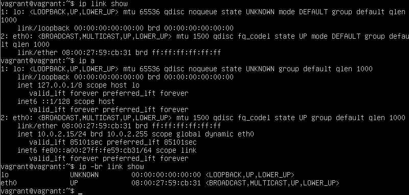
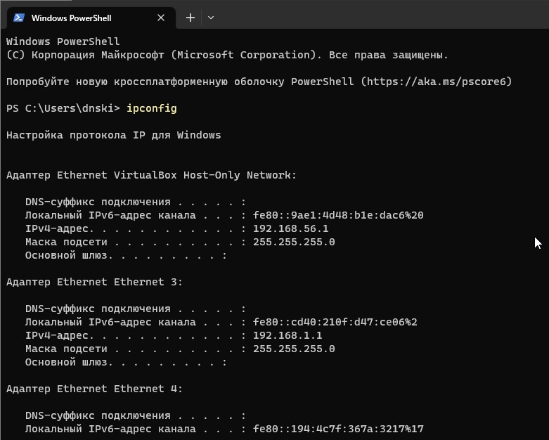
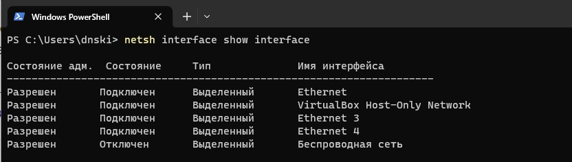
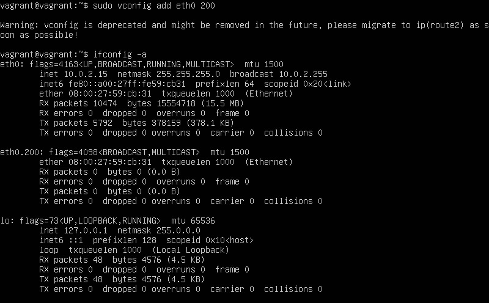
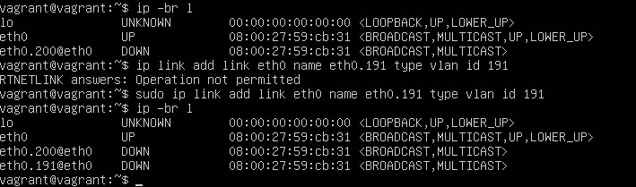
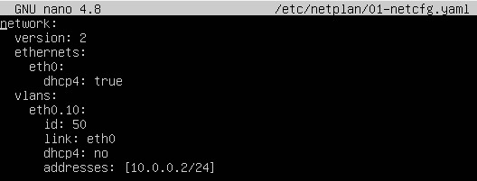

# Компьютерные сети 2

1. Проверьте список доступных сетевых интерфейсов на вашем компьютере. Какие команды есть для этого в Linux и в Windows?

    Linux

    

    Windows

    

    

2. Какой протокол используется для распознавания соседа по сетевому интерфейсу? Какой пакет и команды есть в Linux для этого?

    Протоколы для распознания соседа по сетевому интерфейсу:
    * CDP
    * FDP
    * NDP
    * LLTD
    
    В Linux используется пакет lldpd

    Команды: `lldpcli show neighbors`, `ip neigh show`

3. Какая технология используется для разделения L2 коммутатора на несколько виртуальных сетей? Какой пакет и команды есть в Linux для этого? Приведите пример конфига.

    Для разделения L2 коммутатора на несколько виртуальных сетей используется технология vlan.

    Есть одноименный пакет vlan с командами:

    

    Также есть пакет iproute2 с командами:

    

    Пример конфига:
    
    

    `ip a` после выполнения команды `netplan apply`

    

4. 

    