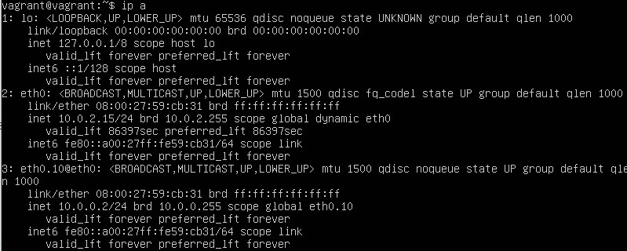

# Компьютерные сети 2

1. Проверьте список доступных сетевых интерфейсов на вашем компьютере. Какие команды есть для этого в Linux и в Windows?

    Linux

    

    Windows

    

    

2. Какой протокол используется для распознавания соседа по сетевому интерфейсу? Какой пакет и команды есть в Linux для этого?

    Протоколы для распознания соседа по сетевому интерфейсу:
    * CDP
    * FDP
    * NDP
    * LLTD
    
    В Linux используется пакет lldpd

    Команды: `lldpcli show neighbors`, `ip neigh show`

3. Какая технология используется для разделения L2 коммутатора на несколько виртуальных сетей? Какой пакет и команды есть в Linux для этого? Приведите пример конфига.

    Для разделения L2 коммутатора на несколько виртуальных сетей используется технология vlan.

    Есть одноименный пакет vlan с командами:

    

    Также есть пакет iproute2 с командами:

    

    Пример конфига:
    
    

    `ip a` после выполнения команды `netplan apply`

    

4. Какие типы агрегации интерфейсов есть в Linux? Какие опции есть для балансировки нагрузки? Приведите пример конфига.

    Типы агрегации интерфейсов в Linux:

    Mode-0(balance-rr) – Данный режим используется по умолчанию. Balance-rr обеспечивается балансировку нагрузки и отказоустойчивость. В данном режиме сетевые пакеты отправляются “по кругу”, от первого интерфейса к последнему. Если выходят из строя интерфейсы, пакеты отправляются на остальные оставшиеся. Дополнительной настройки коммутатора не требуется при нахождении портов в одном коммутаторе. При разностных коммутаторах требуется дополнительная настройка.

    Mode-1(active-backup) – Один из интерфейсов работает в активном режиме, остальные в ожидающем. При обнаружении проблемы на активном интерфейсе производится переключение на ожидающий интерфейс. Не требуется поддержки от коммутатора.

    Mode-2(balance-xor) – Передача пакетов распределяется по типу входящего и исходящего трафика по формуле ((MAC src) XOR (MAC dest)) % число интерфейсов. Режим дает балансировку нагрузки и отказоустойчивость. Не требуется дополнительной настройки коммутатора/коммутаторов.

    Mode-3(broadcast) – Происходит передача во все объединенные интерфейсы, тем самым обеспечивая отказоустойчивость. Рекомендуется только для использования MULTICAST трафика.

    Mode-4(802.3ad) – динамическое объединение одинаковых портов. В данном режиме можно значительно увеличить пропускную способность входящего так и исходящего трафика. Для данного режима необходима поддержка и настройка коммутатора/коммутаторов.

    Mode-5(balance-tlb) – Адаптивная балансировки нагрузки трафика. Входящий трафик получается только активным интерфейсом, исходящий распределяется в зависимости от текущей загрузки канала каждого интерфейса. Не требуется специальной поддержки и настройки коммутатора/коммутаторов.

    Mode-6(balance-alb) – Адаптивная балансировка нагрузки. Отличается более совершенным алгоритмом балансировки нагрузки чем Mode-5. Обеспечивается балансировку нагрузки как исходящего так и входящего трафика. Не требуется специальной поддержки и настройки коммутатора/коммутаторов.

    Пример конфига:

    

5. Сколько IP адресов в сети с маской /29 ? Сколько /29 подсетей можно получить из сети с маской /24. Приведите несколько примеров /29 подсетей внутри сети 10.10.10.0/24.

    В сети с маской /29 6 IP адресов.

    

    32 подсети /29 можно получить из сети с маской /24 - это можно узнать при помощи команды `ipcalc 191.18.70.1 255.255.255.0 255.255.255.248`:

    

    Сеть 10.10.10.0/24 можно разбить на 32 подсети с маской /29: 

    

6. Задача: вас попросили организовать стык между 2-мя организациями. Диапазоны 10.0.0.0/8, 172.16.0.0/12, 192.168.0.0/16 уже заняты. Из какой подсети допустимо взять частные IP адреса? Маску выберите из расчета максимум 40-50 хостов внутри подсети.

    От 100.64.0.0 до 100.127.255.255 с маской подсети 255.192.0.0 или /10; данная подсеть рекомендована согласно rfc6598 для использования в качестве адресов для CGN (Carrier-Grade NAT)

    

7. Как проверить ARP таблицу в Linux, Windows? Как очистить ARP кеш полностью? Как из ARP таблицы удалить только один нужный IP?

    Проверка таблицы:

    - Linux: `ip neigh`, `arp -n`
    - Windows: `arp -a`

    Очистика кэша:

    - Linux: `ip neigh flush`
    - Windows: `arp -d *`

    Удаление одного IP:

    - Linux: `ip neigh delete <IP> dev <INTERFACE>`, `arp -d <IP>`
    - Windows: `arp -d <IP>`

    