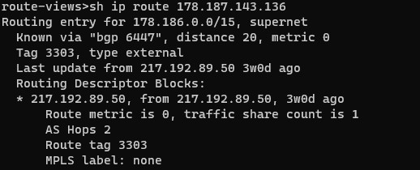
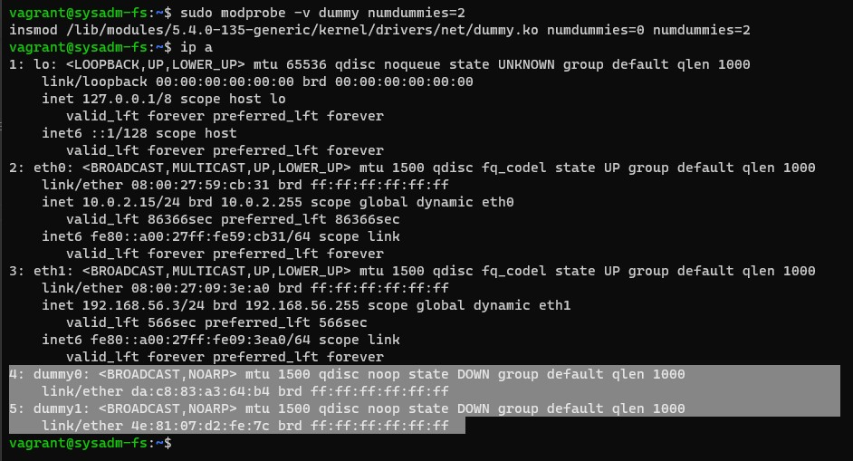
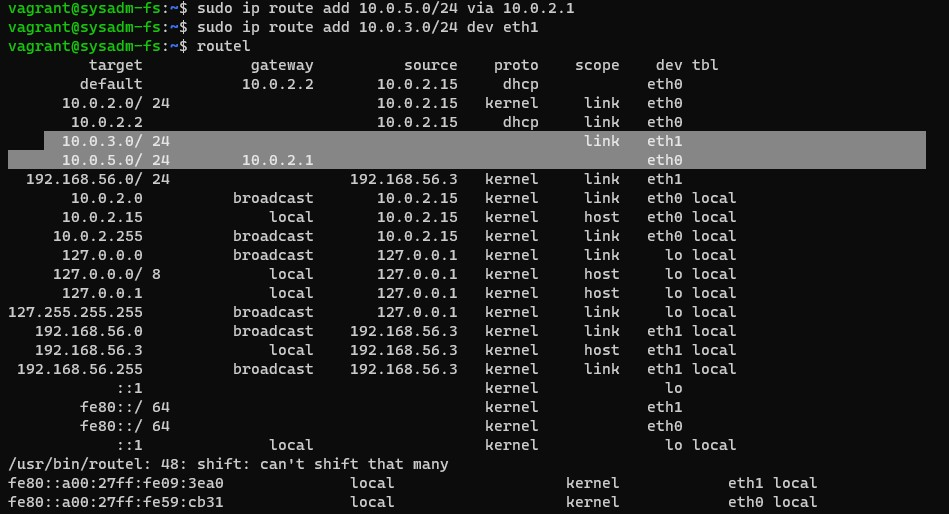
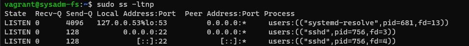
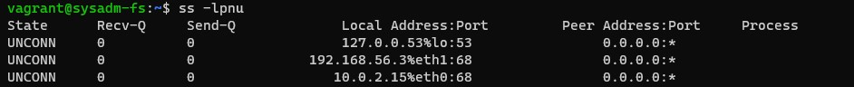
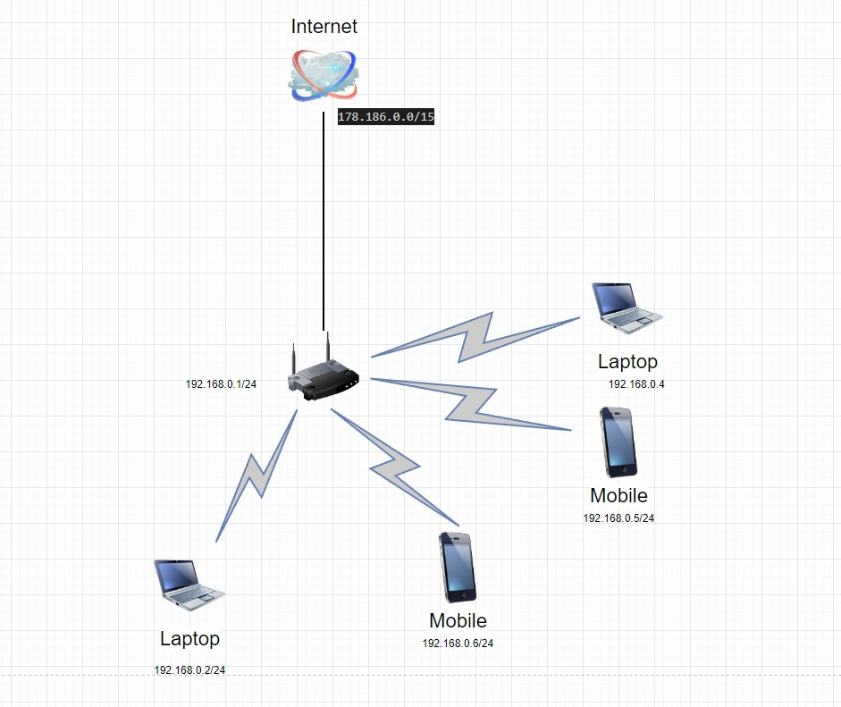

# Компьютерные сети 3

1. Подключитесь к публичному маршрутизатору в интернет. Найдите маршрут к вашему публичному IP.

    

    ```bash
    route-views>sh bgp 178.187.143.136
    BGP routing table entry for 178.186.0.0/15, version 2752655644
    Paths: (20 available, best #20, table default)
    Not advertised to any peer
    Refresh Epoch 1
    3549 3356 12389
        208.51.134.254 from 208.51.134.254 (67.16.168.191)
        Origin IGP, metric 0, localpref 100, valid, external
        Community: 3356:2 3356:22 3356:100 3356:123 3356:501 3356:901 3356:2065 3549:2581 3549:30840
        path 7FE0516E4540 RPKI State valid
        rx pathid: 0, tx pathid: 0
    Refresh Epoch 1
    3267 12389
        194.85.40.15 from 194.85.40.15 (185.141.126.1)
        Origin IGP, metric 0, localpref 100, valid, external
        path 7FE0F64F8728 RPKI State valid
        rx pathid: 0, tx pathid: 0
    Refresh Epoch 1
    20912 3257 1299 12389
        212.66.96.126 from 212.66.96.126 (212.66.96.126)
        Origin IGP, localpref 100, valid, external
        Community: 3257:8066 3257:30055 3257:50001 3257:53900 3257:53902 20912:65004
        path 7FE04B50D5B0 RPKI State valid
        rx pathid: 0, tx pathid: 0
    Refresh Epoch 1
    20130 6939 12389
        140.192.8.16 from 140.192.8.16 (140.192.8.16)
        Origin IGP, localpref 100, valid, external
        path 7FE171EE91B0 RPKI State valid
        rx pathid: 0, tx pathid: 0
    Refresh Epoch 1
    3356 12389
        4.68.4.46 from 4.68.4.46 (4.69.184.201)
        Origin IGP, metric 0, localpref 100, valid, external
        Community: 3356:2 3356:22 3356:100 3356:123 3356:501 3356:901 3356:2065
        path 7FE0F94DE7B0 RPKI State valid
        rx pathid: 0, tx pathid: 0
    Refresh Epoch 1
    852 3356 12389
        154.11.12.212 from 154.11.12.212 (96.1.209.43)
        Origin IGP, metric 0, localpref 100, valid, external
        path 7FE0F2B370E8 RPKI State valid
        rx pathid: 0, tx pathid: 0
    Refresh Epoch 1
    57866 3356 12389
        37.139.139.17 from 37.139.139.17 (37.139.139.17)
        Origin IGP, metric 0, localpref 100, valid, external
        Community: 3356:2 3356:22 3356:100 3356:123 3356:501 3356:901 3356:2065 57866:100 65100:3356 65103:1 65104:31
        unknown transitive attribute: flag 0xE0 type 0x20 length 0x30
            value 0000 E20A 0000 0064 0000 0D1C 0000 E20A
                0000 0065 0000 0064 0000 E20A 0000 0067
                0000 0001 0000 E20A 0000 0068 0000 001F

        path 7FE04ED10738 RPKI State valid
        rx pathid: 0, tx pathid: 0
    Refresh Epoch 1
    3333 1103 12389
        193.0.0.56 from 193.0.0.56 (193.0.0.56)
        Origin IGP, localpref 100, valid, external
        path 7FE16E7C9708 RPKI State valid
        rx pathid: 0, tx pathid: 0
    Refresh Epoch 1
    49788 12552 12389
        91.218.184.60 from 91.218.184.60 (91.218.184.60)
        Origin IGP, localpref 100, valid, external
        Community: 12552:12000 12552:12100 12552:12101 12552:22000
        Extended Community: 0x43:100:0
        path 7FE0F67F2368 RPKI State valid
        rx pathid: 0, tx pathid: 0
    Refresh Epoch 1
    6939 12389
        64.71.137.241 from 64.71.137.241 (216.218.253.53)
        Origin IGP, localpref 100, valid, external
        path 7FE0B1B9E498 RPKI State valid
        rx pathid: 0, tx pathid: 0
    Refresh Epoch 1
    8283 1299 12389
        94.142.247.3 from 94.142.247.3 (94.142.247.3)
        Origin IGP, metric 0, localpref 100, valid, external
        Community: 1299:30000 8283:1 8283:101 8283:102
        unknown transitive attribute: flag 0xE0 type 0x20 length 0x24
            value 0000 205B 0000 0000 0000 0001 0000 205B
                0000 0005 0000 0001 0000 205B 0000 0005
                0000 0002
        path 7FE189333A08 RPKI State valid
        rx pathid: 0, tx pathid: 0
    Refresh Epoch 1
    101 3356 12389
        209.124.176.223 from 209.124.176.223 (209.124.176.223)
        Origin IGP, localpref 100, valid, external
        Community: 101:20100 101:20110 101:22100 3356:2 3356:22 3356:100 3356:123 3356:501 3356:901 3356:2065
        Extended Community: RT:101:22100
        path 7FE118F88528 RPKI State valid
        rx pathid: 0, tx pathid: 0
    Refresh Epoch 1
    19214 174 12389
        208.74.64.40 from 208.74.64.40 (208.74.64.40)
        Origin IGP, localpref 100, valid, external
        Community: 174:21101 174:22005
        path 7FE165D61768 RPKI State valid
        rx pathid: 0, tx pathid: 0
    Refresh Epoch 1
    7018 3356 12389
        12.0.1.63 from 12.0.1.63 (12.0.1.63)
        Origin IGP, localpref 100, valid, external
        Community: 7018:5000 7018:37232
        path 7FE13DA175F0 RPKI State valid
        rx pathid: 0, tx pathid: 0
    Refresh Epoch 1
    1351 6939 12389
        132.198.255.253 from 132.198.255.253 (132.198.255.253)
        Origin IGP, localpref 100, valid, external
        path 7FE111C9CD88 RPKI State valid
        rx pathid: 0, tx pathid: 0
    Refresh Epoch 1
    4901 6079 1299 12389
        162.250.137.254 from 162.250.137.254 (162.250.137.254)
        Origin IGP, localpref 100, valid, external
        Community: 65000:10100 65000:10300 65000:10400
        path 7FE15D940418 RPKI State valid
        rx pathid: 0, tx pathid: 0
    Refresh Epoch 1
    3257 3356 12389
        89.149.178.10 from 89.149.178.10 (213.200.83.26)
        Origin IGP, metric 10, localpref 100, valid, external
        Community: 3257:8794 3257:30043 3257:50001 3257:54900 3257:54901
        path 7FE0E70DC860 RPKI State valid
        rx pathid: 0, tx pathid: 0
    Refresh Epoch 1
    3561 3910 3356 12389
        206.24.210.80 from 206.24.210.80 (206.24.210.80)
        Origin IGP, localpref 100, valid, external
        path 7FE0FCF3E0A0 RPKI State valid
        rx pathid: 0, tx pathid: 0
    Refresh Epoch 2
    2497 12389
        202.232.0.2 from 202.232.0.2 (58.138.96.254)
        Origin IGP, localpref 100, valid, external
        path 7FE0F93BDA70 RPKI State valid
        rx pathid: 0, tx pathid: 0
    Refresh Epoch 1
    3303 12389
        217.192.89.50 from 217.192.89.50 (138.187.128.158)
        Origin IGP, localpref 100, valid, external, best
        Community: 3303:1004 3303:1006 3303:1030 3303:3056
        path 7FE01DA8FD38 RPKI State valid
        rx pathid: 0, tx pathid: 0x0
    ```

2. Создайте dummy0 интерфейс в Ubuntu. Добавьте несколько статических маршрутов. Проверьте таблицу маршрутизации.

    Создание интерфейсов dummy: 

    

    Добавление статических маршрутов и проверка таблицы маршрутизации:

    

3. Проверьте открытые TCP порты в Ubuntu, какие протоколы и приложения используют эти порты? Приведите несколько примеров.

    

    :53 - протокол DNS процесс systemd-resolve
    :22 - протокол SSH процесс sshd

4. Проверьте используемые UDP сокеты в Ubuntu, какие протоколы и приложения используют эти порты?

    

    :53 - DNS
    :68 - DHCP

5. Используя diagrams.net, создайте L3 диаграмму вашей домашней сети или любой другой сети, с которой вы работали.

    