# Компоненты Kubernetes

## Задача 1: Установить Kubernetes

Выполнил следующее для установки minikube и docker:

- curl -LO https://storage.googleapis.com/kubernetes-release/release/`curl -s https://storage.googleapis.com/kubernetes-release/release/stable.txt`/bin/linux/amd64/kubectl
- chmod +x ./kubectl
- sudo mv ./kubectl /usr/local/bin/kubectl
- sudo apt-get update && sudo apt-get install docker.io conntrack -y
- curl -Lo minikube https://storage.googleapis.com/minikube/releases/latest/minikube-linux-amd64 && chmod +x minikube && sudo mv minikube /usr/local/bin/
    

`minikube version` 
    
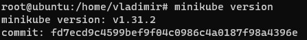

Далее выполнил команду `minikube start --vm-driver=none`, но запуск не удался, т.к. требовался crictl
    
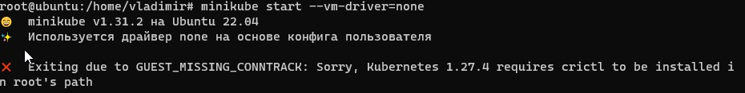
    
Установил crictl воспользовавшись [подсказкой](https://github.com/kubernetes-sigs/cri-tools)

Далее для запуска minikube потребовалось установить cri-dockerd и для его установки я тоже воспользовался [подсказкой](https://github.com/Mirantis/cri-dockerd).

 После чего снова попытался запустить minikube и на этот раз он потребовал установить CNI, на что minikube дал [подсказку](https://minikube.sigs.k8s.io/docs/faq/#how-do-i-install-containernetworking-plugins-for-none-driver) сам

После этого minikube запустился успешно!

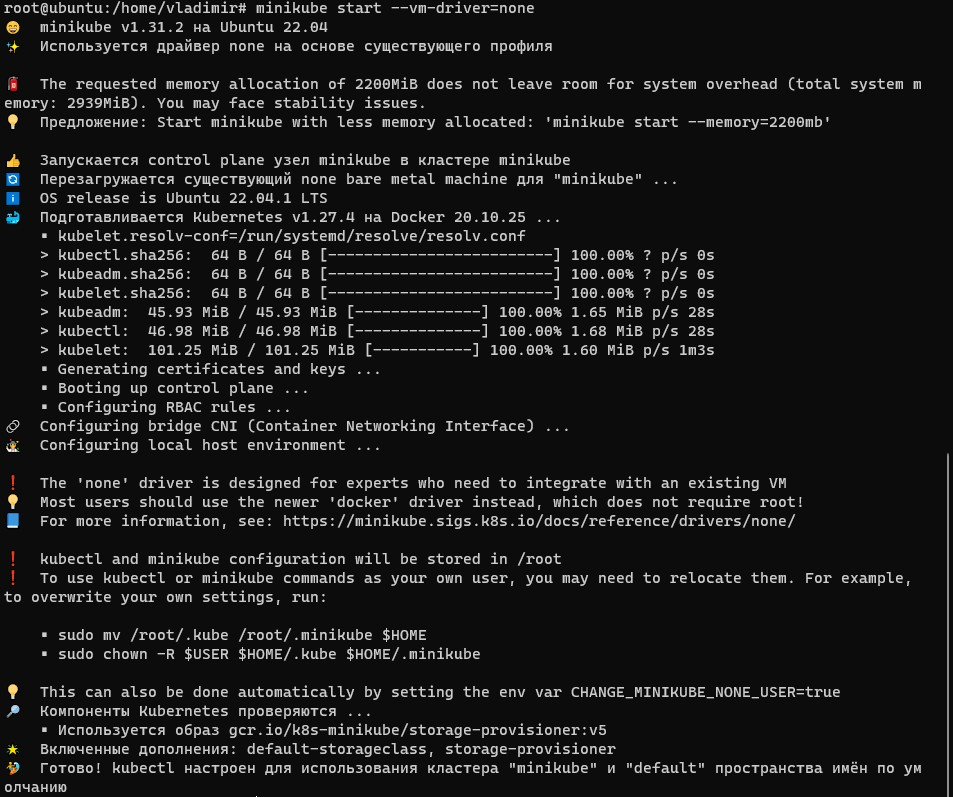

## Задача 2: Запуск Hello, World!

Тестовое приложение было развернуто четко по [туториалу](https://kubernetes.io/ru/docs/tutorials/hello-minikube/#%D1%81%D0%BE%D0%B7%D0%B4%D0%B0%D0%BD%D0%B8%D0%B5-%D0%BA%D0%BB%D0%B0%D1%81%D1%82%D0%B5%D1%80%D0%B0-minikube)

И был получет ip и port сервиса

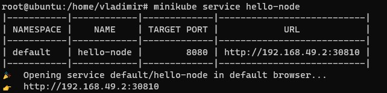

Изначально была идея вытащить сервис наружу, т.к. в данной системе не было интерфейса, но идея не увенчалась успехом... И я решил просто обратиться к этому адресу при помощи `curl` и вот что получил:

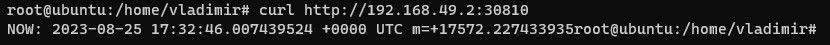

Тоже самое я проделал с `dashboard`

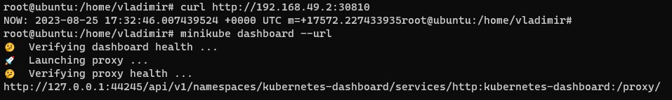

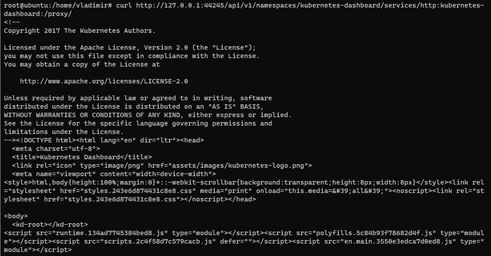

Т.к. затея вытащить сервисы наружу не увенчалась успехом, было принято решение развернуть minikube на виртуальной машине с графическим интерфейсом, чтобы увидеть и убедиться в том, что все работает.... Была проделана установка minikube на виртуальную машину в том же порядке, что указан выше....
И вот что с этого вышло:

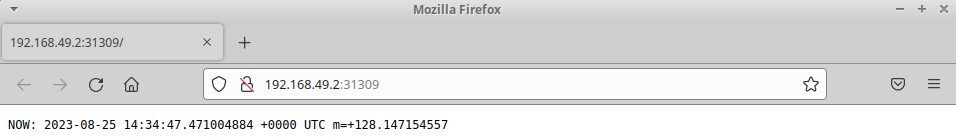

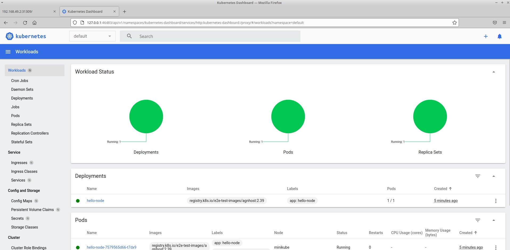

Так же, далее были установлены addon ingress

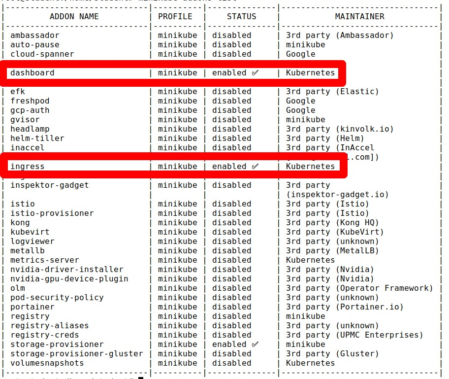

## Задача 3: Установить kubectl

Для того, чтобы проверить работу приложения из задания выше была выполнена команда:

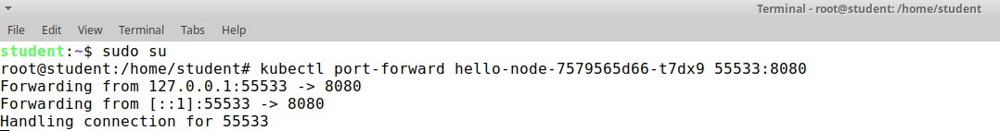

Данная команда позволила подключиться к сервису по loopback с портом 55533

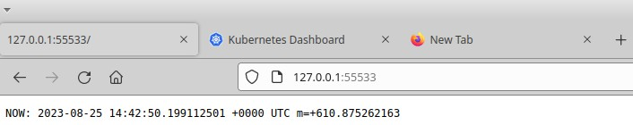

И то же самое для проверки было сделано в vmware:

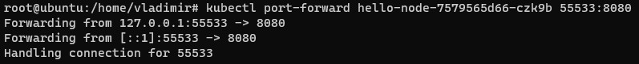

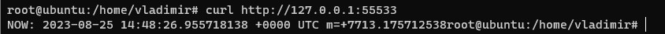

## Что-то получилось исправить

Все-таки получилось вытащить сервис наружу при помощи команды `kubectl port-forward 'название пода' --address 192.168.0.2 55533:8080` и конфигурации NAT в vmware

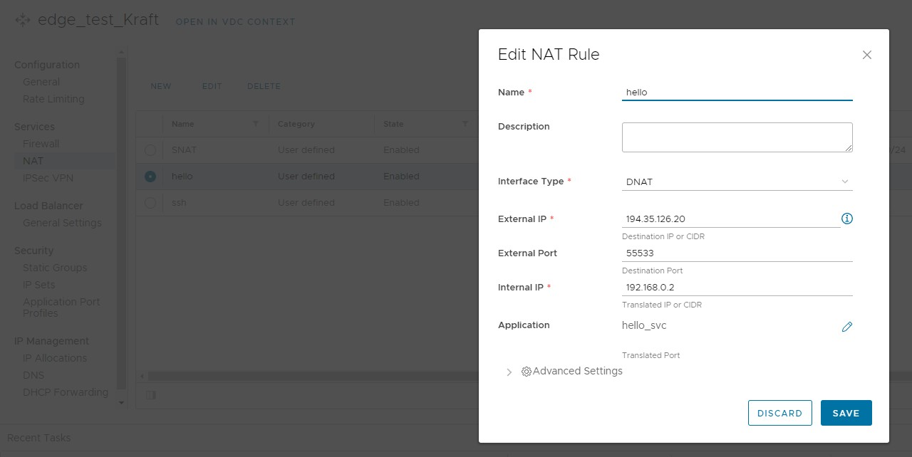

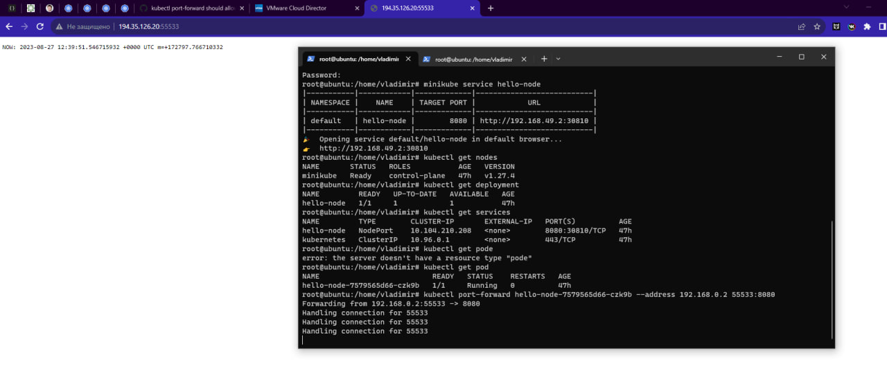

    