# Ветвление в Git - Результаты

- Создание директории branching и файлов merge.sh и rebase.sh 
     
    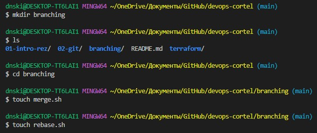
     
- Создание ветки git-merge и переключение на нее
     
    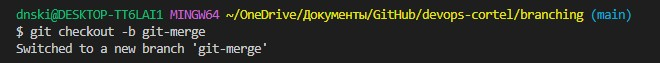
     
    Далее в ветке git-merge было сделано два коммита:  merge: @ instead * и merge: use shift
     
- После этого в ветке main был сделан коммит change rebasse.sh
- Для того, чтобы создать ветку git-rebase на коммите prepare for merge and rebase, необходимо было найти хэш этого коммита при помощи команды git log
     
    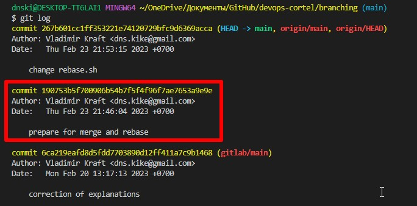
     
- Переход на коммит prepare for merge and rebase по хэшу
     
    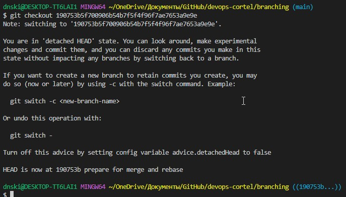
     
- Создание ветки git-rebase и переключение на нее
     
    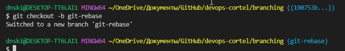
     
- Далее в ветке git-rebase было сделано два коммита: git-rebase 1 и git-rebase 2. В этих коммитах изменялся файл rebase.sh
- Промежуточный итог
     
    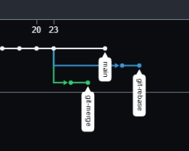
     
- Переключение на ветку main и мерж ветки git-merge в ветку main
     
    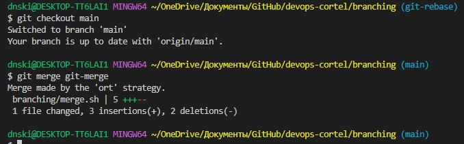
     
- Результат мержа ветки git-merge
     
    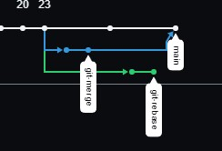
     
- Далее выполнялось перебазирование ветки git-rebase и в появившемся окне редактора нужно было указать на слияние двух коммитов в один при помощи ключевого слова fixup
     
    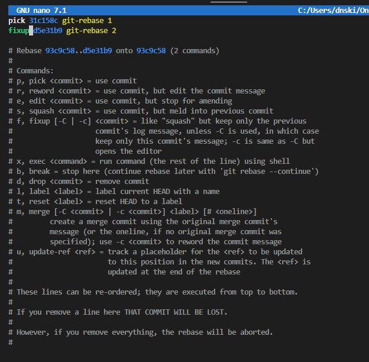
     
- Но создалась конфликтная ситуация
     
    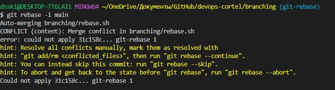
     
- Для того, чтобы разрешить конфликт необходимо посмотреть в содержимое файла rebase.sh и убрать метки установленные гитом вместе со строкой echo "Parameter: $param"
     
    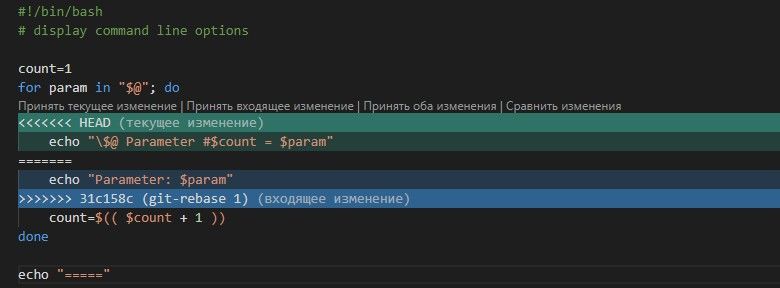
     
- Попытка продолжить rebase
     
    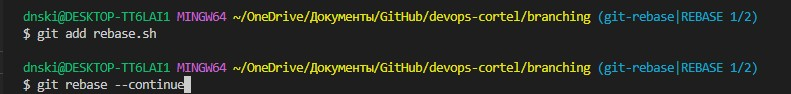
     
- Снова получаем конфликт. Для того чтобы разрешить его нужно снова посмотреть содержимое файла rebase.sh и убрать метки установленные гитом.
     
    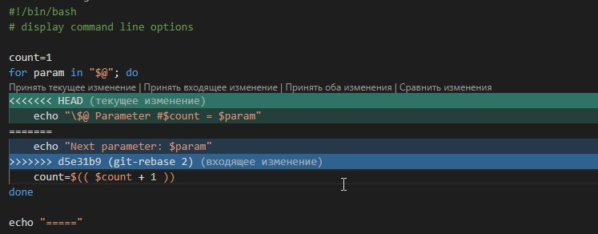
     
- Продолжаем rebase и получаем сообщение
     
    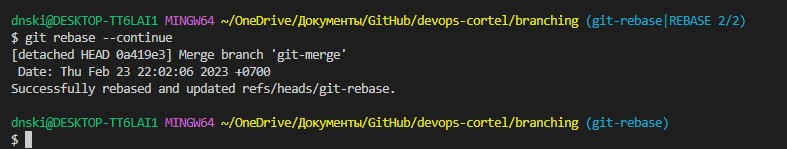
     
- Далее нужно сделать push, но git выдаст ошибку т.к. мы пытаемся перезаписать историю, чтобы git позволил это сделать необходимо доабвить флаг -f
     
    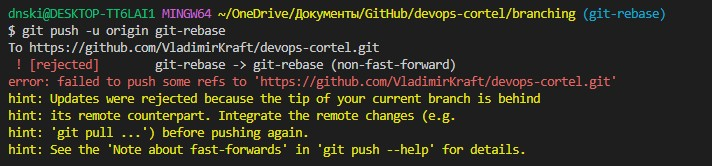
     
- git push -u origin git-rebase -f
     
    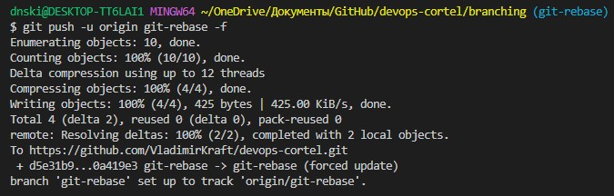
     
- Далее мержим ветку git-rebase в main без конфликтов
     
    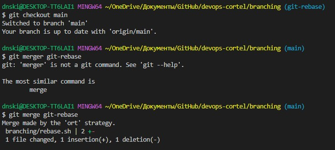
