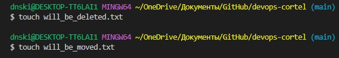
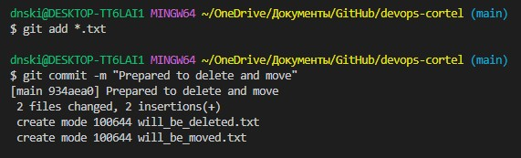
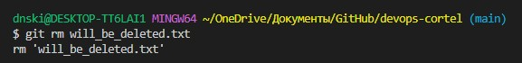
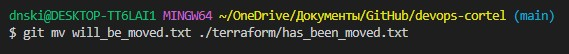

# Описание файла .gitignore

Благодаря файлу .gitignore в будущем будут проигнорированы файлы:

1. Будет проигнорированна директория .terraform
2. Будут проигнорированны файлы \*.tfstate и \*.tfstate.\* 
(\* заменяет 0 и более символов)
3. Будет проигнорирован файл crash.log и файлы crasg.\*.log
4. Будут проигнорированы файлы с расширением \*.tfvars и \*.tfvars.json
5. Будут проигнорированы override файлы (override.tf, override.tf.json, файлы у которых в имени есть _override и они имеют расширение .tf, либо .tf.json)
6. Будет проигнорирован файл .terraformrc и файл terraform.rc

# Работа с перемещением и удалением файлов

- Создание файлов: 
     
    
     
- Добавление в коммит и коммит:
     
    
     
- Удаление файла:
     
    
     
- Перемещение (переименование файла):
     
    
     
    
