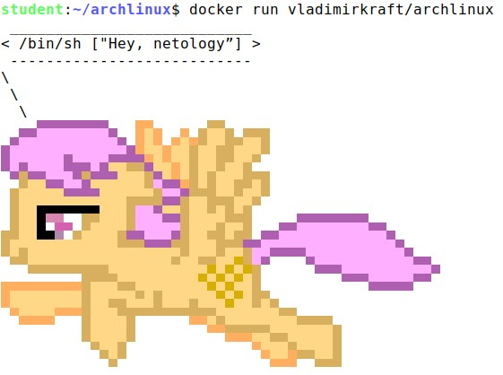

# Практические навыки работы с Docker

## Задача 1

В данном задании вы научитесь изменять существующие Dockerfile, адаптируя их под нужный инфраструктурный стек.

Измените базовый образ предложенного Dockerfile на Arch Linux c сохранением его функциональности.

```bash
FROM ubuntu:latest
RUN apt-get update && \
    apt-get install -y software-properties-common && \
    add-apt-repository ppa:vincent-c/ponysay && \
    apt-get update
 
RUN apt-get install -y ponysay
ENTRYPOINT ["/usr/bin/ponysay"]
CMD ["Hey, netology”]
```

Для получения зачета, вам необходимо предоставить:
- Написанный вами Dockerfile
```bash
FROM archlinux:latest

RUN pacman -Syu --noconfirm
RUN pacman -Sy ponysay --noconfirm
RUN ponysay "Hey, netology!"
```

- Скриншот вывода командной строки после запуска контейнера из вашего базового образа



- Ссылку на образ в вашем хранилище docker-hub

[ссылка на образ](https://hub.docker.com/repository/docker/vladimirkraft/archlinux/general)