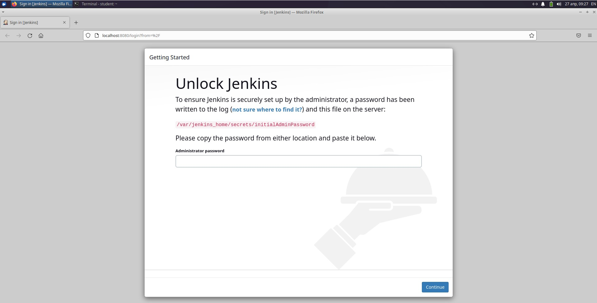
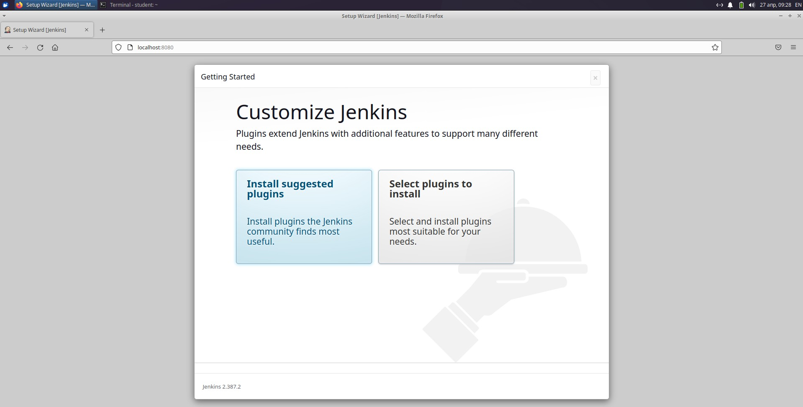
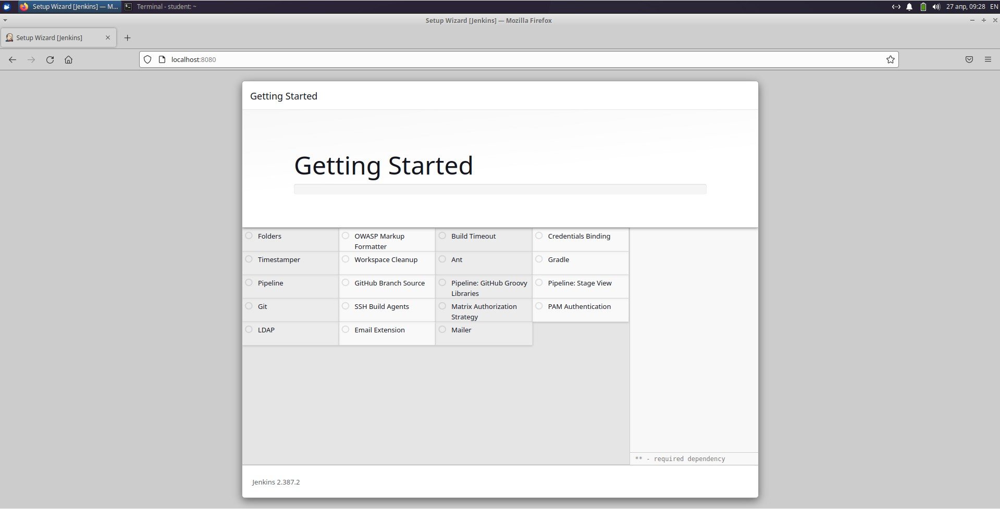
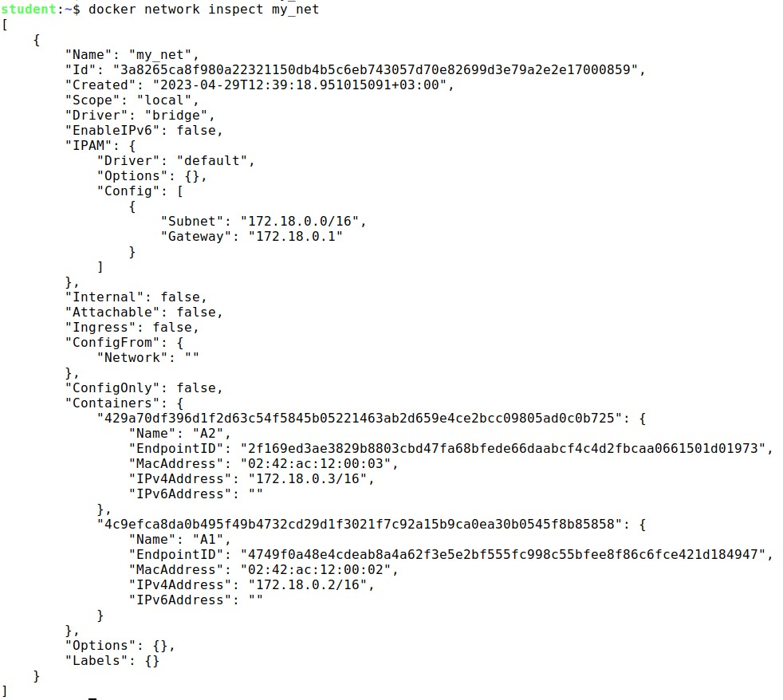

# Практические навыки работы с Docker

## Задача 1

В данном задании вы научитесь изменять существующие Dockerfile, адаптируя их под нужный инфраструктурный стек.

Измените базовый образ предложенного Dockerfile на Arch Linux c сохранением его функциональности.

```bash
FROM ubuntu:latest
RUN apt-get update && \
    apt-get install -y software-properties-common && \
    add-apt-repository ppa:vincent-c/ponysay && \
    apt-get update
 
RUN apt-get install -y ponysay
ENTRYPOINT ["/usr/bin/ponysay"]
CMD ["Hey, netology”]
```

Для получения зачета, вам необходимо предоставить:
- Написанный вами Dockerfile
```bash
FROM archlinux:latest

RUN \
    pacman -Syu --noconfirm \
    && pacman -Sy ponysay --noconfirm \ 
    && ponysay "Hey, netology!"
```

- Скриншот вывода командной строки после запуска контейнера из вашего базового образа


- Ссылку на образ в вашем хранилище docker-hub

[ссылка на образ](https://hub.docker.com/repository/docker/vladimirkraft/archlinux/general)

## Задача 2 
В данной задаче вы составите несколько разных Dockerfile для проекта Jenkins, опубликуем образ в `dockerhub.io` и посмотрим логи этих контейнеров.

- Составьте 2 Dockerfile:

    - Общие моменты:
        - Образ должен запускать [Jenkins server](https://www.jenkins.io/download/)
        
    - Спецификация первого образа:
        - Базовый образ - [amazoncorreto](https://hub.docker.com/_/amazoncorretto)
        - Присвоить образу тэг `ver1` 
    
    - Спецификация второго образа:
        - Базовый образ - [ubuntu:latest](https://hub.docker.com/_/ubuntu)
        - Присвоить образу тэг `ver2` 

- Соберите 2 образа по полученным Dockerfile
- Запустите и проверьте их работоспособность
- Опубликуйте образы в своём dockerhub.io хранилище

Для получения зачета, вам необходимо предоставить:
- Наполнения 2х Dockerfile из задания
- Скриншоты логов запущенных вами контейнеров (из командной строки)
- Скриншоты веб-интерфейса Jenkins запущенных вами контейнеров (достаточно 1 скриншота на контейнер)
- Ссылки на образы в вашем хранилище docker-hub


## Ответ

Развернуть jenkins в контейнере docker можно при помощи команды:

```bash
docker run -d -v jenkins_home:/var/jenkins_home -p 8080:8080 -p 50000:50000 --restart=on-failure jenkins/jenkins:lts-jdk11
```

После того, как контейнер docker запущен, в строку браузера вводим адрес `localhos:8080`, и видим сообщение о том, что нужно ввести пароль:




Далее вводим пароль и переходим на страницу старта работы:



Далее происходит установка необходимых плагинов:




## Задача 3 

В данном задании вы научитесь:
- объединять контейнеры в единую сеть
- исполнять команды "изнутри" контейнера

Для выполнения задания вам нужно:
- Написать Dockerfile: 
    - Использовать образ https://hub.docker.com/_/node как базовый
    - Установить необходимые зависимые библиотеки для запуска npm приложения https://github.com/simplicitesoftware/nodejs-demo
    - Выставить у приложения (и контейнера) порт 3000 для прослушки входящих запросов  
    - Соберите образ и запустите контейнер в фоновом режиме с публикацией порта

- Запустить второй контейнер из образа ubuntu:latest 
- Создайть `docker network` и добавьте в нее оба запущенных контейнера
- Используя `docker exec` запустить командную строку контейнера `ubuntu` в интерактивном режиме
- Используя утилиту `curl` вызвать путь `/` контейнера с npm приложением  

Для получения зачета, вам необходимо предоставить:
- Наполнение Dockerfile с npm приложением
- Скриншот вывода вызова команды списка docker сетей (docker network cli)
- Скриншот вызова утилиты curl с успешным ответом

## Ответ

Все что вышло это настройка сети между двумя контейнерами.

Для начала была создана сеть типа bridge, которая позволяет общаться контейнера между собой в одной сети:

```bash
docker network create my_net
```


Далее были запущены два контейнера командами:

```bash
    docker run -it -d --name A1 ubuntu_one sh;
    docker run -it -d --name A2 ubuntu_one sh;
```

После запуска контейнеров они были подключены к сети my_net при помощи команды:

```bash 
    docker network connect [имя_сети] [имя_контейнера]
```

Далее при помощи команды `docker network inspect my_net` можно убедиться в том, что эти контейнеры в сети my_net:




